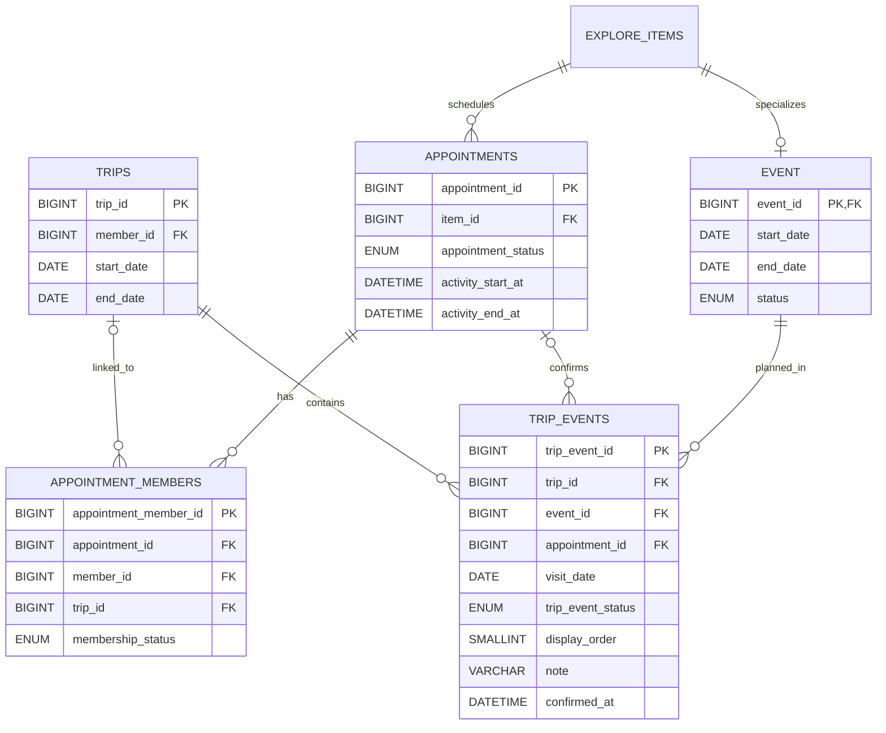

# 여정 이벤트 ERD

이 문서는 여정에 이벤트를 추가하고 그룹 약속과 연결하는 DB 구조를 설명합니다.
Flyway V5 적용 후의 테이블 관계와 DB가 보장하는 규칙을 확인할 수 있습니다.

## 여정 이벤트 관계

`trip_events`는 여행 전체가 아닌 개별 이벤트 일정의 상태를 저장합니다. 한 여정에
추가한 이벤트마다 상태가 다를 수 있기 때문입니다.

## 상태별 저장 규칙

| 상태        | 의미                            | `appointment_id` | `confirmed_at` |
| ----------- | ------------------------------- | ---------------- | -------------- |
| `ADDED`     | 방문 날짜만 선택한 일정         | `NULL`           | `NULL`         |
| `CONFIRMED` | 그룹 약속까지 확정된 일정       | 필수             | 필수           |

`ADDED`는 `visit_date`만으로 타임라인의 날짜를 정합니다. `CONFIRMED`의 정확한
시간은 `appointments.activity_start_at`과 `appointments.activity_end_at`에서
조회합니다. 두 테이블에 같은 시간을 저장하지 않습니다.

## DB가 보장하는 규칙

- `trip_events.trip_id`는 존재하는 여정을 참조합니다.
- `trip_events.event_id`는 `EVENT` 하위 타입을 가진 탐색 항목만 참조합니다.
- `(appointment_id, event_id)` 복합 외래키는 약속과 이벤트의 일치를 보장합니다.
- 같은 여정에는 동일한 이벤트와 방문 날짜 조합을 한 번만 저장합니다.
- 같은 여정과 약속 조합을 한 번만 연결합니다.
- `ADDED`와 `CONFIRMED`에 필요한 값의 조합을 CHECK 제약으로 검증합니다.

## 백엔드에서 검증할 규칙

DB CHECK 제약은 다른 행의 값을 읽을 수 없습니다. 다음 규칙은 후속 백엔드
구현에서 같은 트랜잭션으로 검증합니다.

- `visit_date`가 여정의 `start_date`와 `end_date` 사이인지 확인합니다.
- 여정 소유자와 약속 참가자가 같은 회원인지 확인합니다.
- `ACTIVE` 참가자만 약속 확정 일정에 연결합니다.
- 약속을 확정할 때 기존 `ADDED` 일정을 `CONFIRMED`로 바꿉니다.
- 기존 일정이 없으면 `CONFIRMED` 일정을 새로 만듭니다.

약속이 나중에 취소돼도 확정 이력은 유지합니다. 취소 여부는
`appointments.appointment_status`에서 확인합니다.
