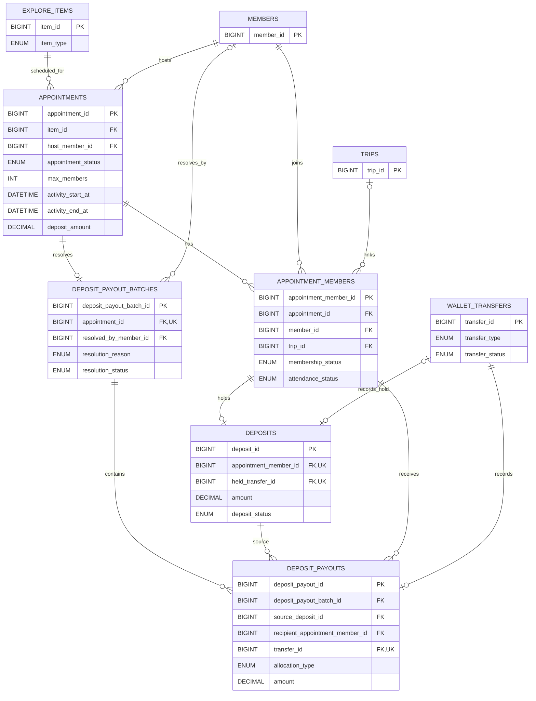

# 약속·참가·보증금 ERD

탐색 항목을 기반으로 만든 그룹 약속과 참가자, 보증금 예치·정산의 관계를
보여줍니다.

- 약속은 이벤트와 장소를 포함하는 `explore_items`를 참조합니다.
- 결제 API가 연결되기 전에는 약속 생성 확인을 완료 처리하지 않습니다. 생성 요청은
  `APPOINTMENT-008`을 반환하며 약속·방장 회원·보증금·지갑 거래를 기록하지 않습니다.
  결제 연동 후에는 결제 성공 콜백에서 `PENDING` → `HELD` 및 `PENDING` → `ACTIVE`
  전이를 같은 트랜잭션으로 수행합니다.
- 참여 요청도 결제 연동 전에는 `APPOINTMENT-008`을 반환하며 참가자 회원·보증금을
  기록하지 않습니다. 결제 연동 후 나간 참가자는 `LEFT`로 기록하며 같은 약속에는
  재참여할 수 없습니다.
- 한 참가 이력에는 보증금 행을 최대 하나만 연결합니다.
- 약속별 payout batch는 하나이며, 실제 금액 이동은 `wallet_transfers`가 기록합니다.
