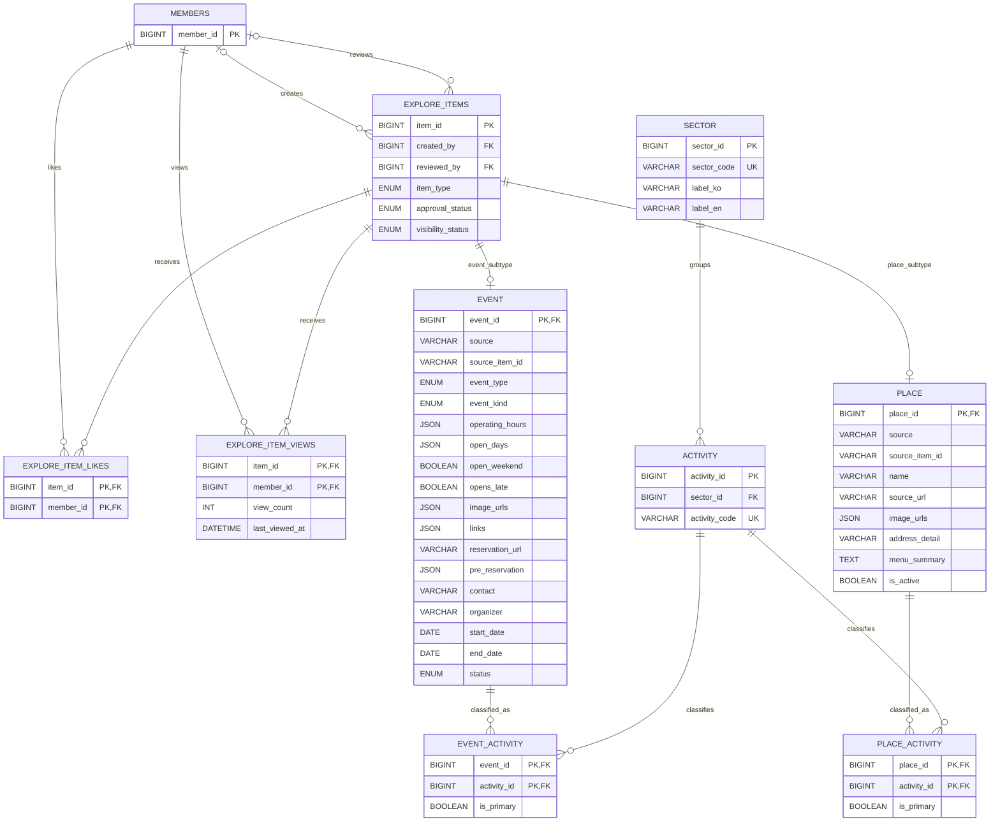

# 탐색·이벤트·장소 ERD

탐색 공통 항목과 이벤트·장소 하위 타입, 분류·사용자 반응의 관계를
보여줍니다.

- `explore_items`가 검수·공개 상태와 공통 통계를 관리합니다.
- `event`와 `place`는 같은 `item_id`를 PK·FK로 사용하는 하위 타입입니다.
- Event·Place의 표시 콘텐츠는 현재 각 기본 테이블에 저장합니다.
- `source`와 `source_item_id` 조합으로 외부 원본 중복을 방지합니다.
- 활동 분류는 이벤트·장소별 연결 테이블로 분리합니다.
- Event 상세 API의 JSON 응답 키는 API 응답 컨벤션에 따라 camelCase로 정규화합니다.
  데이터베이스 컬럼명은 snake_case를 유지합니다.
- `imageUrls`는 이미지 URL 문자열 배열이며, `openDays`는 `mon`부터 `sun`까지의
  요일 코드 문자열 배열입니다.
- `preReservation`은 `{ "has": boolean, "link": string|null,
  "startAt": string|null, "endAt": string|null }` 형태의 객체입니다.
- `links`는 `{ "homepageUrl": string|null, "reservationUrl": string|null }` 형태를
  기본으로 하며, 원본에 추가 링크가 있으면 동일한 camelCase 규칙으로 반환합니다.
- `operatingHours`가 원본에서 문자열로 수집된 경우 `{ "raw": string }` 객체로
  반환하고, 객체로 수집된 경우 내부 키도 camelCase로 정규화합니다.
- 예약 CTA URL은 API 응답 기준으로 `preReservation.has=true`이면
  `preReservation.link`, 다음으로 `reservationUrl`, 마지막으로
  `links.reservationUrl`을 사용합니다.
- `source`, `source_item_id`, `pipeline_id`와 생성·수정 시각은 운영·동기화용이며
  탐색 화면의 표시 응답에는 포함하지 않습니다.
