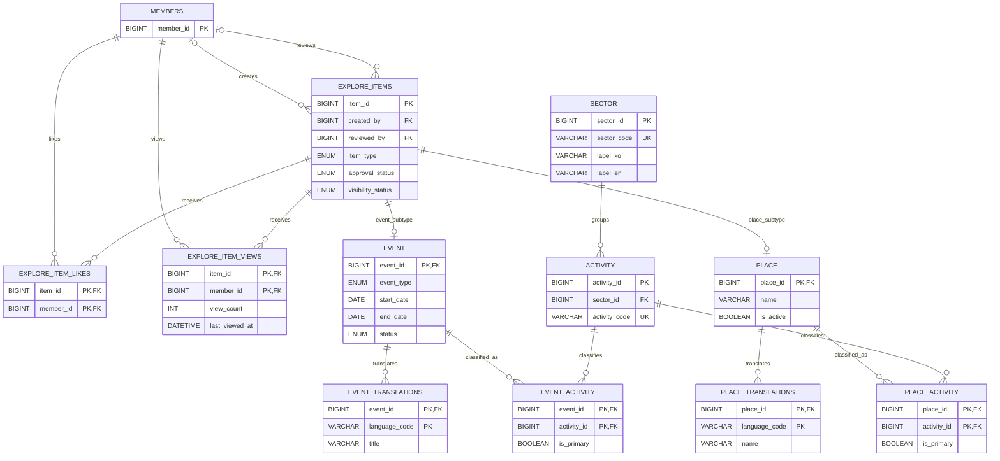

# 탐색·이벤트·장소 ERD

탐색 공통 항목과 이벤트·장소 하위 타입, 분류·번역·사용자 반응의 관계를
보여줍니다.

- `explore_items`가 검수·공개 상태와 공통 통계를 관리합니다.
- `event`와 `place`는 같은 `item_id`를 PK·FK로 사용하는 하위 타입입니다.
- 활동 분류와 번역은 이벤트·장소별 연결 테이블로 분리합니다.
