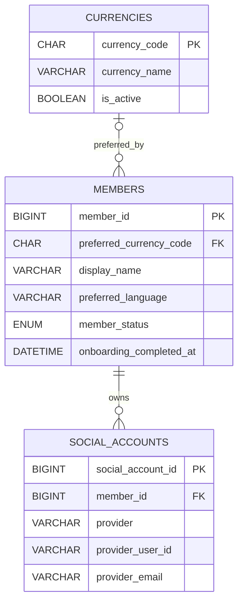

# 회원·인증 ERD

회원 식별 정보와 소셜 계정, 서비스 통화 기준의 관계를 보여줍니다.

```mermaid
erDiagram
    CURRENCIES o|--o{ MEMBERS : preferred_by
    MEMBERS ||--o{ SOCIAL_ACCOUNTS : owns

    CURRENCIES {
        CHAR currency_code PK
        VARCHAR currency_name
        BOOLEAN is_active
    }

    MEMBERS {
        BIGINT member_id PK
        CHAR preferred_currency_code FK
        VARCHAR display_name
        VARCHAR preferred_language
        ENUM member_status
        DATETIME onboarding_completed_at
    }

    SOCIAL_ACCOUNTS {
        BIGINT social_account_id PK
        BIGINT member_id FK
        VARCHAR provider
        VARCHAR provider_user_id
        VARCHAR provider_email
    }
```

- `(provider, provider_user_id)`가 소셜 계정을 고유하게 식별합니다.
- 회원은 선호 통화를 선택하지 않은 상태로 가입할 수 있습니다.
- 인증 세션과 OAuth state는 Redis에 저장하므로 이 ERD에는 포함하지 않습니다.
