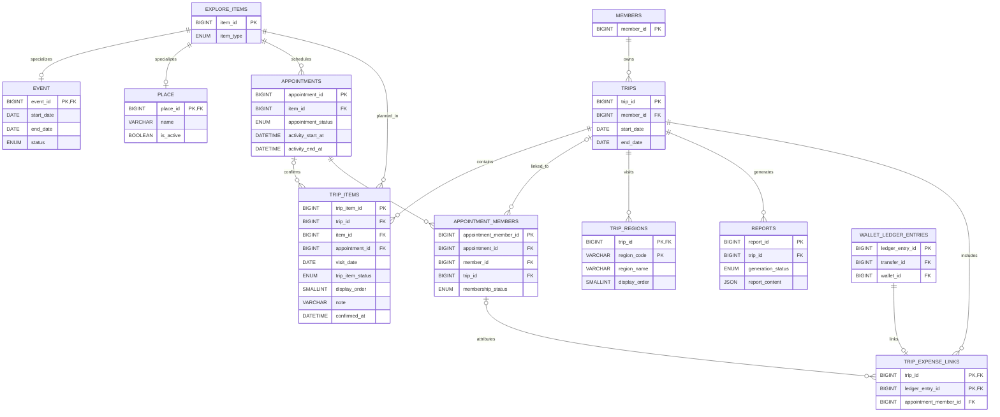

# 여정·일정·리포트 ERD

개인 여정과 방문 지역, 이벤트·장소 일정, 지출 연결, 리포트의 관계를 보여줍니다.

## 여정 항목 관계

`trip_items`는 여행 전체가 아닌 개별 탐색 항목 일정의 상태를 저장합니다. EVENT와
PLACE는 `explore_items`를 통해 같은 여정 일정 흐름을 사용합니다. 한 여정에 추가한
항목마다 상태가 다를 수 있기 때문에 상태는 `trips`가 아닌 `trip_items`에 있습니다.

`trip_regions`는 방문 지역 순서를 관리합니다. `trip_expense_links`는 지갑 원장과
여정을 연결하고, `reports`는 여정 기준 생성 결과를 보존합니다.

## 상태별 저장 규칙

| 상태        | 의미                      | `appointment_id` | `confirmed_at` |
| ----------- | ------------------------- | ---------------- | -------------- |
| `ADDED`     | 방문 날짜만 선택한 일정   | `NULL`           | `NULL`         |
| `CONFIRMED` | 그룹 약속까지 확정된 일정 | 필수             | 필수           |

`ADDED`는 `visit_date`만으로 타임라인의 날짜를 정합니다. `CONFIRMED`의
`visit_date`는 `DATE(appointments.activity_start_at)`과 같은 값을 유지합니다.
정확한 시간은 `appointments.activity_start_at`과 `appointments.activity_end_at`에서
조회하며 `trip_items`에는 중복 저장하지 않습니다.

## DB가 보장하는 규칙

- `trip_items.trip_id`는 존재하는 여정을 참조합니다.
- `trip_items.item_id`는 EVENT 또는 PLACE가 속한 공통 `explore_items`를 참조합니다.
- `(appointment_id, item_id)` 복합 외래키는 약속과 탐색 항목의 일치를 보장합니다.
- 같은 여정에는 동일한 탐색 항목과 방문 날짜 조합을 한 번만 저장합니다.
- 같은 여정과 약속 조합을 한 번만 연결합니다.
- `ADDED`와 `CONFIRMED`에 필요한 값의 조합을 CHECK 제약으로 검증합니다.

## 백엔드에서 검증할 규칙

DB CHECK 제약은 다른 행의 값을 읽을 수 없습니다. 다음 규칙은 후속 백엔드
구현에서 같은 트랜잭션으로 검증합니다.

- `visit_date`가 여정의 `start_date`와 `end_date` 사이인지 확인합니다.
- 여정 소유자와 약속 참가자가 같은 회원인지 확인합니다.
- `ACTIVE` 참가자만 약속 확정 일정에 연결합니다.
- 약속을 확정할 때 `visit_date = DATE(activity_start_at)`인지 확인합니다.
- 기존 `ADDED` 일정이 있으면 약속 시작일로 `visit_date`를 맞추고
  `CONFIRMED`로 바꿉니다.
- 기존 일정이 없으면 약속 시작일을 `visit_date`로 사용해 `CONFIRMED` 일정을
  새로 만듭니다.
- 약속 시작 시간이 변경되면 연결된 모든 `CONFIRMED` 일정의 `visit_date`를 같은
  트랜잭션에서 동기화합니다.
- 동기화한 날짜가 여정 범위를 벗어나거나 동일 여정·항목·날짜 일정과 충돌하면
  약속 시간 변경을 거부합니다.

약속이 나중에 취소돼도 확정 이력은 유지합니다. 취소 여부는
`appointments.appointment_status`에서 확인합니다.
