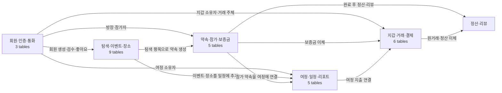

# V10 데이터베이스 지도

이 문서는 Flyway V10 적용 후의 NA-WA 데이터베이스를 도메인 단위로 보여줍니다.
전체 구조를 먼저 이해한 뒤 필요한 상세 ERD로 이동할 수 있습니다.

V9는 정산 테이블을 축소된 계약으로 전환하며 새 서비스 테이블을 만들지 않습니다.
Flyway로 적용하면 관리용 `flyway_schema_history`가 별도로 생성됩니다.

## 전체 도메인 관계

## 도메인별 테이블

| 도메인           | 테이블                                                                                                       | 상세 ERD                                  |
| ---------------- | ------------------------------------------------------------------------------------------------------------ | ----------------------------------------- |
| 회원·인증·통화   | `currencies`, `members`, `social_accounts`                                                                   | [회원·인증 ERD](IDENTITY_ERD.md)          |
| 탐색·이벤트·장소 | `sector`, `activity`, `explore_items`, `event`, `place`, 활동·좋아요·조회 테이블                                  | [탐색 ERD](EXPLORE_ERD.md)                |
| 약속·참가·보증금 | `appointments`, `appointment_members`, `deposits`, `deposit_payout_batches`, `deposit_payouts`               | [약속 ERD](APPOINTMENT_ERD.md)            |
| 여정·일정·리포트 | `trips`, `trip_regions`, `trip_items`, `reports`, `trip_expense_links`                                       | [여정 ERD](JOURNEY_ERD.md)                |
| 지갑·거래·결제   | `wallet_owners`, `wallets`, `wallet_transfers`, `wallet_ledger_entries`, `wallet_topups`, `qr_payment_codes` | [지갑 ERD](WALLET_ERD.md)                 |
| 정산·리뷰        | `settlements`, 정산 상세 테이블, `member_reviews`, 리뷰 점수·키워드 테이블                                   | [정산·리뷰 ERD](SETTLEMENT_REVIEW_ERD.md) |

## 구조 읽는 순서

1. `members`가 회원 소유 데이터의 시작점입니다.
2. `explore_items`가 이벤트와 장소의 공통 부모입니다.
3. `appointments`가 탐색 항목에 대한 그룹 활동을 저장합니다.
4. `trips`와 `trip_items`가 개인 여정과 이벤트·장소 일정을 저장합니다.
5. `wallet_transfers`와 `wallet_ledger_entries`가 금액 이동의 원장입니다.
6. 약속 완료 후 정산과 리뷰가 참가 이력을 참조합니다.

DDL의 최종 기준은 `backend/src/main/resources/db/migration`의 V1~V10입니다. V7은
Event·Place의 출처·상세·미디어 필드를 추가하고 사용하지 않는 번역 테이블을 제거합니다.
V8은 KRW 통화와 회원 지갑을 채우는 데이터 시드라 구조를 바꾸지 않습니다. V9는 정산을
EQUAL·ITEMIZED와 REQUESTED·COMPLETED 상태로 축소하고 생성·지급 멱등성 열을 추가합니다.
V10은 약속 참가자의 `PENDING` 상태와 후기 키워드 기준값을 추가합니다. 이 문서는 V10
적용 DB의 `information_schema`에서 테이블과 외래키를 대조해 갱신해야 합니다.
