# 정산·리뷰 ERD

약속 완료 후의 비용 분담과 참가자 리뷰 구조를 보여줍니다.

```mermaid
erDiagram
    APPOINTMENTS ||--o{ SETTLEMENTS : settles
    MEMBERS ||--o{ SETTLEMENTS : creates
    MEMBERS ||--o{ SETTLEMENTS : pays
    MEMBERS o|--o{ SETTLEMENTS : cancels
    WALLET_TRANSFERS ||--o| SETTLEMENTS : source
    SETTLEMENTS ||--o{ SETTLEMENT_ITEMS : contains
    SETTLEMENTS ||--o{ SETTLEMENT_MEMBERS : includes
    APPOINTMENT_MEMBERS ||--o{ SETTLEMENT_MEMBERS : identifies
    WALLET_TRANSFERS o|--o| SETTLEMENT_MEMBERS : pays
    SETTLEMENT_ITEMS ||--o{ SETTLEMENT_ITEM_SHARES : splits
    SETTLEMENT_MEMBERS ||--o{ SETTLEMENT_ITEM_SHARES : owes
    WALLET_TRANSFERS ||--o{ RECEIPT_ANALYSES : source
    APPOINTMENTS ||--o{ RECEIPT_ANALYSES : analyzes
    RECEIPT_ANALYSES ||--o{ RECEIPT_ANALYSIS_ITEMS : identifies
    RECEIPT_ANALYSIS_ITEMS ||--o{ RECEIPT_ITEM_ALLOCATIONS : allocates
    APPOINTMENT_MEMBERS ||--o{ RECEIPT_ITEM_ALLOCATIONS : receives
    SETTLEMENTS ||--o| SETTLEMENT_GAMES : configures
    SETTLEMENTS ||--o{ SETTLEMENT_GAME_MEMBERS : invites
    APPOINTMENT_MEMBERS ||--o{ SETTLEMENT_GAME_MEMBERS : responds

    APPOINTMENTS ||--o{ MEMBER_REVIEWS : reviews_after
    APPOINTMENT_MEMBERS ||--o{ MEMBER_REVIEWS : reviewer
    APPOINTMENT_MEMBERS ||--o{ MEMBER_REVIEWS : reviewed
    MEMBER_REVIEWS ||--o{ MEMBER_REVIEW_SCORES : scores
    MEMBER_REVIEWS ||--o{ MEMBER_REVIEW_KEYWORD_SELECTIONS : selects
    MEMBER_REVIEW_KEYWORDS ||--o{ MEMBER_REVIEW_KEYWORD_SELECTIONS : provides

    APPOINTMENTS {
        BIGINT appointment_id PK
    }

    MEMBERS {
        BIGINT member_id PK
    }

    APPOINTMENT_MEMBERS {
        BIGINT appointment_member_id PK
        BIGINT appointment_id FK
        BIGINT member_id FK
    }

    WALLET_TRANSFERS {
        BIGINT transfer_id PK
    }

    SETTLEMENTS {
        BIGINT settlement_id PK
        BIGINT appointment_id FK
        BIGINT created_by_member_id FK
        BIGINT payer_member_id FK
        BIGINT source_transfer_id FK, UK
        VARCHAR idempotency_key UK
        CHAR request_fingerprint
        ENUM settlement_status
        DECIMAL total_amount
    }

    SETTLEMENT_ITEMS {
        BIGINT settlement_item_id PK
        BIGINT settlement_id FK
        DECIMAL unit_price
        DECIMAL line_total
    }

    SETTLEMENT_MEMBERS {
        BIGINT settlement_member_id PK
        BIGINT settlement_id FK
        BIGINT appointment_member_id FK
        BIGINT paid_transfer_id FK, UK
        ENUM participant_status
        ENUM request_status
    }

    SETTLEMENT_ITEM_SHARES {
        BIGINT settlement_item_share_id PK
        BIGINT settlement_item_id FK
        BIGINT settlement_member_id FK
        DECIMAL allocated_amount
    }

    RECEIPT_ANALYSES {
        BIGINT receipt_analysis_id PK
        BIGINT source_transfer_id FK
        BIGINT appointment_id FK
        ENUM analysis_status
        DECIMAL recognized_total
    }

    RECEIPT_ANALYSIS_ITEMS {
        BIGINT receipt_analysis_item_id PK
        BIGINT receipt_analysis_id FK
        DECIMAL quantity
        DECIMAL line_total
    }

    RECEIPT_ITEM_ALLOCATIONS {
        BIGINT receipt_item_allocation_id PK
        BIGINT receipt_analysis_item_id FK
        BIGINT appointment_member_id FK
        DECIMAL allocated_quantity
        DECIMAL allocated_amount
    }

    SETTLEMENT_GAMES {
        BIGINT settlement_id PK, FK
        VARCHAR game_type
        INT liable_count
        ENUM game_status
    }

    SETTLEMENT_GAME_MEMBERS {
        BIGINT settlement_id PK, FK
        BIGINT appointment_member_id PK, FK
        ENUM consent_status
        BOOLEAN is_liable
    }

    MEMBER_REVIEWS {
        BIGINT review_id PK
        BIGINT appointment_id FK
        BIGINT reviewer_appointment_member_id FK
        BIGINT reviewed_appointment_member_id FK
        ENUM visibility_status
    }

    MEMBER_REVIEW_SCORES {
        BIGINT review_id PK, FK
        ENUM review_category PK
        TINYINT rating
    }

    MEMBER_REVIEW_KEYWORDS {
        BIGINT keyword_id PK
        VARCHAR keyword_code UK
        BOOLEAN is_active
    }

    MEMBER_REVIEW_KEYWORD_SELECTIONS {
        BIGINT review_id PK, FK
        BIGINT keyword_id PK, FK
    }
```

- 정산은 약속의 참가자 집합과 원거래를 기준으로 생성합니다.
- 정산 생성 멱등성은 `(created_by_member_id, idempotency_key)` UNIQUE와 요청 지문으로
  보장합니다. `source_transfer_id`도 UNIQUE이므로 취소한 원거래를 재정산하지 않습니다.
- DB는 행별 금액과 수량이 음수가 되지 않도록 검증합니다. 항목·참가자 간 합계
  일치는 후속 서비스 트랜잭션에서 검증합니다.
- 영수증 항목과 배분은 `ALLOCATED` 상태에서 정산 항목·항목별 분담으로 복제되어, 이후
  영수증 변경과 독립적인 정산 스냅샷으로 보존됩니다.
- 게임형 정산은 전원 동의 후 서버가 확정한 `is_liable` 값만으로 실제 결제 부담자를 결정합니다.
- 리뷰 작성자와 대상자는 같은 약속의 `appointment_members`로 제한합니다.
