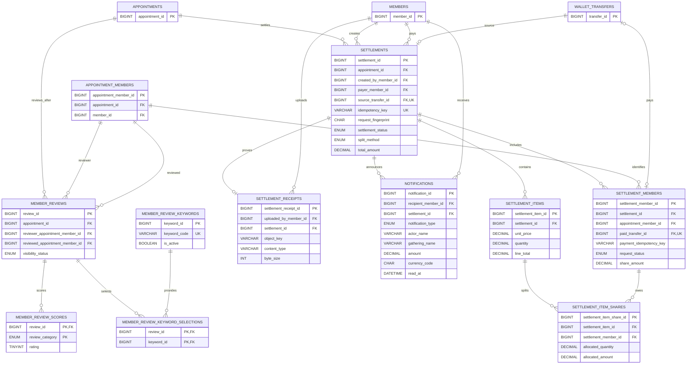

# 정산·리뷰 ERD

약속 완료 후의 비용 분담과 참가자 리뷰 구조를 보여준다.

- 정산은 약속의 참가자 집합과 원거래를 기준으로 생성합니다.
- DB는 행별 금액과 수량이 음수가 되지 않도록 검증합니다. 항목·참가자 간 합계
  일치는 후속 서비스 트랜잭션에서 검증합니다.
- 후기 키워드 기준값은 `FRIENDLY`, `ON_TIME`, `CONSIDERATE`,
  `GOOD_COMMUNICATOR`, `WOULD_JOIN_AGAIN`이며 화면 문구는 Vue i18n에서 관리합니다.
- `source_transfer_id` UNIQUE는 하나의 원거래가 여러 정산에 사용되는 것을 막는다.
- 생성 멱등성은 `(created_by_member_id, idempotency_key)` UNIQUE와 요청 지문으로
  보장한다.
- `paid_transfer_id` UNIQUE와 `PAID` 상태의 이체·시각 CHECK는 지급을 한 번만 확정한다.
- ITEMIZED 정산의 품목과 품목별 수량 배분은 정산 자체의 스냅샷으로 보관한다.
- 리뷰 작성자와 대상자는 같은 약속의 `appointment_members`로 제한한다.

## 영수증

`settlement_receipts`는 영수증 사진이 S3 어디에 있는지만 가리킨다. 사진 자체는 DB에 넣지
않는다.

`settlement_id`가 비어 있는 행은 아직 정산에 붙지 않은 **초안**이다. 사용자가 사진을 먼저
올리고 품목을 확정한 뒤 정산을 만들 때 이 값이 채워진다. 정산 품목이 영수증에서 나온
값이라 사진이 먼저 있어야 하기 때문이다.

`settlement_id`에 UNIQUE가 걸려 있다. MySQL은 UNIQUE 열에 NULL을 여러 개 허용하므로 초안
여러 개가 공존하면서도 정산 하나에는 사진이 한 장만 붙는다.

`object_key`는 반드시 `receipts/`로 시작한다. IAM 정책이 이 접두사로 좁혀져 있어 벗어난
키는 런타임에 접근이 거부된다.

## 알림

`notifications`는 정산에서 일어난 일을 받는 사람 앞으로 한 줄씩 쌓아 둔다. 정산에서 파생된
표시용 데이터라 정산 상태의 정본이 아니다.

`actor_name`·`gathering_name`·`amount`·`currency_code`는 **알림을 만들 때 복사해 둔 값**이다.
매번 원본을 조인해 오지 않는 이유는, 상대가 이름을 바꾸거나 정산이 지워져도 그때 받은
알림은 받았던 그 문장 그대로 남아야 하기 때문이다.

`read_at`이 비어 있으면 아직 안 읽은 알림이다. 읽음 여부를 참/거짓으로 두지 않고 시각으로
두면 언제 읽었는지까지 남는다.

목록 조회도 미읽음 개수도 "내 알림을 최신순으로"만 묻는다. 두 질문이
`(recipient_member_id, created_at DESC)` 인덱스 하나를 함께 쓴다.

계약과 알림 종류별 수신자 규칙은 [알림 API 계약](../NOTIFICATION_API.md)에 있다.
