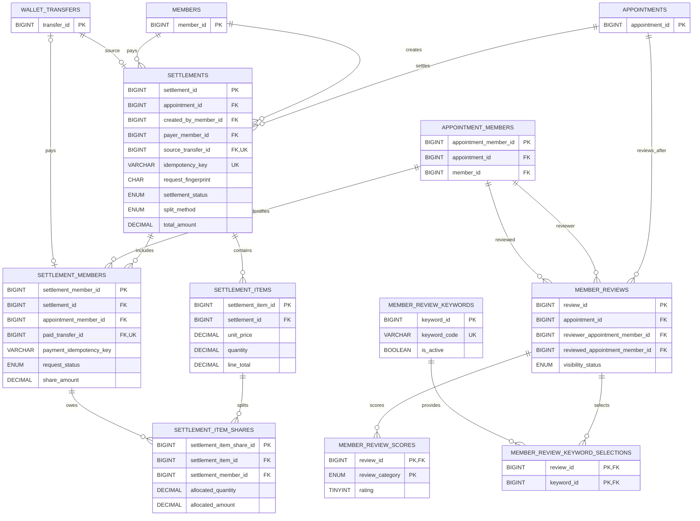

# 정산·리뷰 ERD

약속 완료 후의 비용 분담과 참가자 리뷰 구조를 보여준다.

- 정산은 약속의 참가자 집합과 원거래를 기준으로 생성합니다.
- DB는 행별 금액과 수량이 음수가 되지 않도록 검증합니다. 항목·참가자 간 합계
  일치는 후속 서비스 트랜잭션에서 검증합니다.
- 리뷰 작성자와 대상자는 같은 약속의 `appointment_members`로 제한합니다.
- 후기 키워드 기준값은 `FRIENDLY`, `ON_TIME`, `CONSIDERATE`,
  `GOOD_COMMUNICATOR`, `WOULD_JOIN_AGAIN`이며 화면 문구는 Vue i18n에서 관리합니다.
- `source_transfer_id` UNIQUE는 하나의 원거래가 여러 정산에 사용되는 것을 막는다.
- 생성 멱등성은 `(created_by_member_id, idempotency_key)` UNIQUE와 요청 지문으로
  보장한다.
- `paid_transfer_id` UNIQUE와 `PAID` 상태의 이체·시각 CHECK는 지급을 한 번만 확정한다.
- ITEMIZED 정산의 품목과 품목별 수량 배분은 정산 자체의 스냅샷으로 보관한다.
- 리뷰 작성자와 대상자는 같은 약속의 `appointment_members`로 제한한다.
