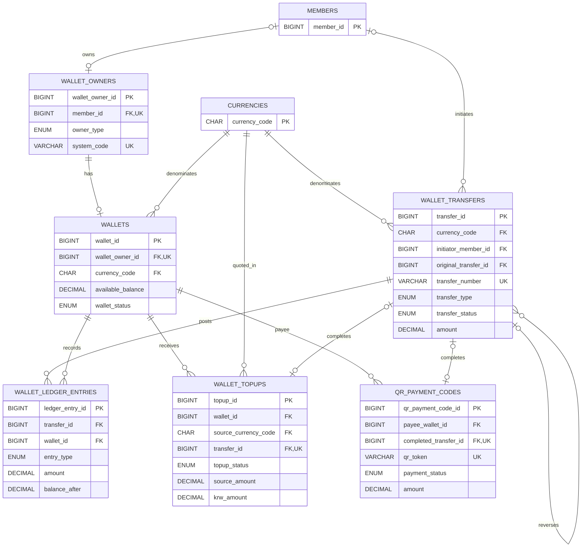

# 지갑·거래·결제 ERD

회원·시스템 지갑과 복식 원장, 충전·QR 결제의 관계를 보여줍니다.

- `wallet_transfers`가 비즈니스 거래를 기록하고 원장 행이 차변·대변을 구성합니다.
- `wallet_owners`는 회원 지갑과 시스템 지갑을 같은 구조로 표현합니다.
- 충전과 QR 결제는 완료 시 생성된 transfer를 선택적으로 연결합니다.
