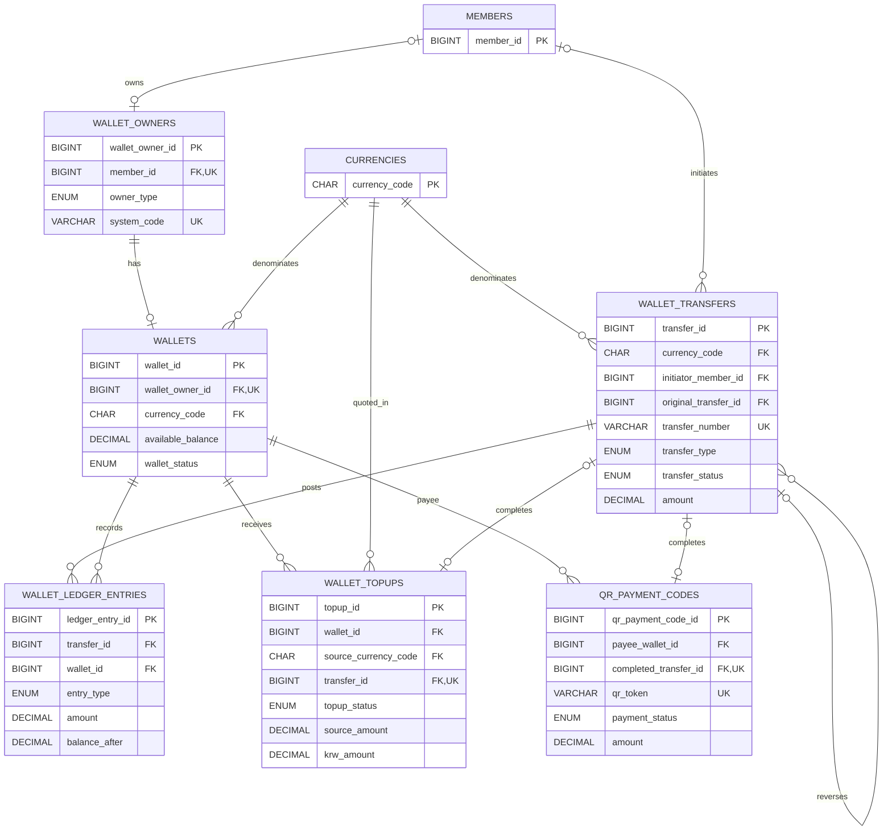

# 지갑·거래·결제 ERD

회원·시스템 지갑과 복식 원장, 충전·QR 결제의 관계를 보여줍니다.

- `wallet_transfers`가 비즈니스 거래를 기록하고 원장 행이 차변·대변을 구성합니다.
- `wallet_owners`는 회원 지갑과 시스템 지갑을 같은 구조로 표현합니다.
- 충전과 QR 결제는 완료 시 생성된 transfer를 선택적으로 연결합니다.

## 회원은 지갑 정체성을 하나만 가집니다

`uq_wallet_owners_member (member_id)`와 `uq_wallets_owner (wallet_owner_id)`에는
`deleted_at`이 들어 있지 않습니다. 그래서 soft-delete된 행이 남아 있으면 같은 회원으로
새 지갑을 만들 수 없습니다. 반면 조회 경로(`WalletMapper.findByMemberId`)는
`deleted_at IS NULL`인 지갑만 봅니다.

`WalletProvisioningServiceImpl.provisionForMember()`는 이 교착을 다음 규칙으로 풉니다.

- 행이 없으면 만듭니다. 남아 있으면 `deleted_at`만 `NULL`로 되돌립니다.
- `wallet_id`, 잔액, `wallet_status`, 통화, 원장·거래 이력은 그대로 둡니다.
  `wallet_status`를 `ACTIVE`로 되돌리지 않는 이유는 `SUSPENDED`·`CLOSED` 지갑을
  재가입으로 우회시키지 않기 위해서입니다.
- 성공 판정은 UPDATE의 변경 행 수가 아니라 확보한 ID로 합니다. 이미 `deleted_at`이
  `NULL`인 행에는 복구 UPDATE가 0행을 남기기 때문입니다.

## 탈퇴는 파기, 재가입은 신규 회원입니다

2026-08-18에 #169에서 확정한 정책입니다. 아직 구현 전이며, 현재 `main`에는
`wallets`·`wallet_owners`의 `deleted_at`을 세팅하는 코드가 없습니다. 구현은 #256,
UNIQUE 제약 마이그레이션은 #255가 담당합니다.

- 탈퇴하면 `members`의 식별 필드(이름·이미지 등)를 익명화합니다. 거래 원장은
  상대방 정합성을 위해 익명화된 상태로 보존합니다.
- 재가입은 신규 회원으로 취급합니다. 잔액과 이력을 승계하지 않습니다.
  `social_accounts`의 기존 행은 탈퇴 시 파기해 같은 소셜 계정의 신규 가입을
  허용합니다.
- 환급 플로우가 구현되기 전까지, 잔액이 0이 아니거나 미정산 예치금이 있으면
  탈퇴를 차단합니다.
- 위의 UNIQUE 제약은 `deleted_at`을 반영하도록 바꿔야 신규 지갑 발급이
  가능합니다(#255).

`provisionForMember()`의 되살리기 규칙은 활성 회원 전용으로 유지합니다. 탈퇴
계정의 지갑은 되살리지 않습니다.
